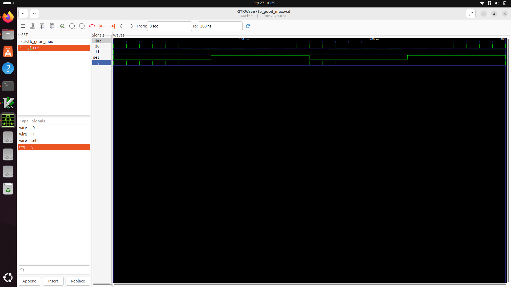

<div align="center">

# Day 1 - Introduction to Verilog RTL Design & Synthesis

</div>  
We’re kicking off your digital design journey today! You’ll dive straight into hardware description using Verilog, run your first experiments with the Icarus Verilog simulator, and get an early taste of circuit synthesis using Yosys. The session blends hands-on labs with simple explanations, 
giving you a practical starting point to develop strong fundamentals in RTL development.


## Table of Contents:
1. Introduction to Simulator,Design,Testbench and iverilog
2. Practical work with iverilog + gtkwave
3. Overview of Yosys and core synthesis concepts
4. Practical exercises with Yosys and the SKY130 PDK

## Introduction to Simulator,Design,Testbench and iverilog

1) A simulation program allows you to evaluate how a digital design behaves. By feeding in sample signals and observing the responses, you can confirm the correctness of the design long before moving to physical hardware.
2) In digital design, the term “design” refers to the Verilog source code you write. This code captures the logical behavior you want the circuit to implement — for example, how inputs should be processed to produce the desired outputs.
3) A testbench is a setup where you give different inputs to your circuit and watch the outputs. It helps you check if your design works the way you want.
4) Iverilog simulates Verilog designs by combining the circuit and testbench, then outputs a .vcd file for GTKWave waveform analysis.

<div align="center"> 
  
  
  
</div>

<div align="center">
  
</div>

## Practical work with iverilog + gtkwave
To simulate 2x1 MUX:

### 1) Clone the Workshop Repository
```bash
git clone https://github.com/kunalg123/sky130RTLDesignAndSynthesisWorkshop.git
cd sky130RTLDesignAndSynthesisWorkshop/verilog_files
```
### 2) Install gvim
```bash
sudo apt update
sudo apt install vim-gtk3
```
### 3) Simulating the Design and viewing waveform
```bash
iverilog good_mux.v tb_good_mux.v
```
```bash
./a.out
```
```bash
gtkwave tb_good_mux.vcd
```


Code of good_mux.v and tb_good_mux.v


Working:
1.Inputs: i0, i1 (data signals), sel (control signal)
2.Output: y (stored result)
3.Behavior: When sel = 1, y takes the value of i1; when sel = 0, y takes the value of i0.

## Overview of Yosys and core synthesis concepts
Yosys is a free tool that changes your Verilog code into logic gates. This process, called synthesis, takes the design you describe in RTL and converts it into a gate-level circuit that can be built on hardware like FPGAs or chips.
Following is the flow of Yosys:
```bash
yosys
```
```bash
read_liberty -lib /address/to/your/sky130/file/sky130_fd_sc_hd__tt_025C_1v80.lib
```
```bash
read_verilog /home/vsduser/VLSI/sky130RTLDesignAndSynthesisWorkshop/verilog_files/good_mux.v
```
```bash
synth -top good_mux
```
```bash
abc -liberty /address/to/your/sky130/file/sky130_fd_sc_hd__tt_025C_1v80.lib
```
```bash
show
```


From this Day 1, I gained following insights:
1.I understood the purpose of simulators and how they help check circuit behavior.
2.I learned what a design is and how Verilog code describes logic.
3.I discovered the role of a testbench in providing inputs and verifying outputs.
4.I wrote my first Verilog program and practiced simulation using iverilog.
5.I generated a .vcd file and viewed waveforms in GTKWave.
6.I analyzed the code for a 2-to-1 multiplexer and understood its working.
7.I got introduced to Yosys for synthesis.
8.I learned that gate libraries exist in multiple forms for different needs.
9.I connected the flow: RTL → Simulation → Synthesis → Gates.


